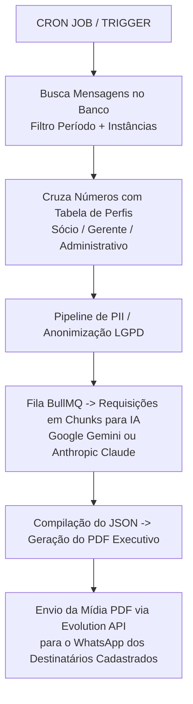

# Documento de Requisitos de Produto (PRD)

## Módulo de Auditoria Jurídica, Compliance e Resumo Executivo de Comunicação (IA)

| Campo | Valor |
|---|---|
| Status | Rascunho |
| Data | 2026-08-01 |
| Owner | A definir |
| Sistema base | Evolution API |

---

## 1. Visão Geral do Produto

### 1.1 Objetivo

Desenvolver um módulo corporativo assíncrono e configurável para análise e sumarização de históricos de mensagens em massa. O sistema utiliza Modelos de Linguagem de Grande Porte (Google Gemini e Anthropic Claude) para auditagens sob a ótica de compliance/direito do trabalho e para a geração de resumos executivos de alinhamento operacional entre papéis-chave da empresa (Sócios, Gerentes e Administrativo).

### 1.2 Problema

- **Passivo Jurídico**: Acompanhar manualmente conversas em múltiplas instâncias corporativas do WhatsApp é inviável, expondo a empresa a riscos não detectados de assédio moral, assédio sexual, danos morais e linguagem tóxica.
- **Perda de Visibilidade Gerencial**: Sócios e diretores não possuem uma síntese clara sobre como está a comunicação diária, o fluxo de ordens e o nível de fricção entre a gerência e o setor administrativo.

### 1.3 Solução

Uma plataforma de auditoria em lote (*batch processing*) com disparo periódico e configurável (semanal, mensal, anual ou customizado). A solução classifica os papéis hierárquicos dos interlocutores, anonimiza dados sensíveis (LGPD), executa auditoria jurídica e síntese executiva por IA, e envia relatórios executivos em PDF diretamente no WhatsApp dos responsáveis cadastrados.

---

## 2. Estrutura de Mapeamento de Papéis e Perfis (NOVO)

Para que a IA entenda a hierarquia, o poder diretivo e a dinâmica de cobrança nas conversas, o sistema incluirá um submódulo de **Classificação de Contatos**.

### 2.1 Papéis Suportados

| Papel | Descrição |
|---|---|
| `SOCIO` (Sócio / Diretoria) | Alta liderança. A IA avalia diretrizes estratégicas e previne abusos de poder ou exposição da empresa. |
| `GERENTE` (Gerência / Gestão) | Liderança intermediária. A IA analisa o tom de cobrança aplicado à equipe e o cumprimento de ordens vindas dos sócios. |
| `ADMINISTRATIVO` (Equipe Administrativa) | Equipe de suporte interno. A IA analisa o fluxo de demandas, sobrecarga e cordialidade nas solicitações. |
| `OUTRO` / `COLABORADOR` | Demais colaboradores ou contatos externos. |

---

## 3. Requisitos Funcionais (RF)

### RF01 - Mapeamento e Gestão de Perfis de Contatos

- **RF01.1**: Módulo para cadastrar, editar e vincular números de WhatsApp a papéis específicos (`SOCIO`, `GERENTE`, `ADMINISTRATIVO`).
- **RF01.2**: Permissão para importação em lote via CSV contendo colunas: `Nome`, `Telefone` (formato internacional), `Papel`, `Instância`.
- **RF01.3**: Contextualização na análise: o motor de IA deve receber a informação explícita do papel de cada interlocutor no par de conversa analisado (ex.: "Conversa entre SÓCIO e GERENTE" ou "Conversa entre GERENTE e ADMINISTRATIVO").

### RF02 - Configuração do Período e Agendamento

- **RF02.1**: Periodicidade de análise configurável: Semanal, Mensal, Anual ou Intervalo Personalizado (data início e data fim).
- **RF02.2**: Definição de dia da semana, dia do mês e horário para execução da varredura automatizada via Cron Job.

### RF03 - Seleção de Instâncias e Filtros

- **RF03.1**: Opção de selecionar "Todas as Instâncias" ou selecionar instâncias específicas da Evolution API.
- **RF03.2**: Filtro de exclusão de contatos (lista negra de JIDs/números que não devem entrar na auditoria, como bots ou notificações automáticas).

### RF04 - Motor de IA Configurável (Engine)

- **RF04.1**: Alternância dinâmica entre provedores de IA por instância ou por execução:
  - **Google Gemini**: `gemini-1.5-pro`, `gemini-1.5-flash`
  - **Anthropic Claude**: `claude-3-5-sonnet`, `claude-3-haiku`
  - **OpenAI**: `gpt-4o`, `gpt-4o-mini`
- **RF04.2**: Cadastro seguro e criptografado das chaves de API (API Keys).
- **RF04.3**: Ajuste de parâmetros do modelo (Temperature, Top-P, Max Tokens).

### RF05 - Auditoria Jurídica e Compliance

Análise contextual detalhada cobrindo os seguintes eixos:

- **Assédio Moral**: Cobranças vexatórias, desqualificação profissional, ameaças de demissão explícitas ou veladas, imposição de metas abusivas.
- **Assédio Sexual / Insinuações**: Comentários impróprios sobre aparência, chantagens ou linguagem de teor sexual.
- **Tom Hostil / Agressividade**: Uso de caixa alta recorrente, ironias destrutivas, xingamentos ou impaciência desmedida.
- **Danos Morais e Discriminação**: Preconceito de gênero, raça, religião ou condição física.
- **Insubordinação / Ruptura de Fluxo**: Descumprimento deliberado de ordens diretas entre Gerente e Administrativo, ou Sócio e Gerente.

### RF06 - Resumo Executivo de Comunicação Interna (NOVO)

Além da auditoria de risco, o sistema gerará uma **Síntese de Comunicação Executiva** focada no trio SÓCIO ↔ GERENTE ↔ ADMINISTRATIVO:

- **Resumo de Alinhamento**: Principais decisões tomadas e direcionamentos dados pelos Sócios.
- **Gargalos Operacionais**: Dificuldades reportadas pelo setor Administrativo à Gerência que não foram resolvidas.
- **Clima e Tom Geral**: Avaliação do nível de cordialidade e eficiência na comunicação entre as camadas de gestão.
- **Pontos de Atenção Gerencial**: Atrasos em entregas, ruídos de comunicação ou ordens contraditórias.

### RF07 - Filtro de Anonimização (LGPD)

- **RF07.1**: Remoção/substituição de dados pessoais sensíveis (PII) como CPF, números de cartão, dados bancários e e-mails pessoais antes do envio para a API da IA.
- **RF07.2**: Substituição de nomes reais por placeholders estruturados mantendo o papel (ex.: `[SOCIO_1]`, `[GERENTE_A]`, `[ADMIN_B]`).

### RF08 - Envio Automático de Relatório PDF via WhatsApp

- **RF08.1**: Módulo de cadastro de destinatários para recebimento do relatório com os seguintes campos:
  - Nome do Responsável
  - Número do WhatsApp (com DDI e DDD)
  - Condição de Disparo: `Sempre` (Relatório Periódico Completo) ou `Apenas quando houver Risco Alto/Crítico`
- **RF08.2**: Gerador de PDF automático estruturado com layout executivo.
- **RF08.3**: Disparo do PDF anexado a uma mensagem de texto explicativa usando a Evolution API.

---

## 4. Requisitos Não-Funcionais (RNF)

| Categoria | Especificação do Requisito |
|---|---|
| Arquitetura | Processamento totalmente assíncrono utilizando filas (BullMQ + Redis) para garantir que o processamento em lote não trave a aplicação. |
| Segurança | Armazenamento de chaves de API e tokens com criptografia AES-256-GCM. Controle de acesso restrito (RBAC). |
| Desempenho | Capacidade de processar até 500.000 mensagens por lote com paginação (*chunking*) inteligente. |
| Privacidade | Garantia de não utilização dos dados enviados para treinamento de modelos públicos (uso de APIs Enterprise/Verificadas de Gemini/Claude). |

---

## 5. Engenharia de Prompts (Prompt Master)

### Prompt de Auditoria Jurídica e Resumo Executivo

**SYSTEM PROMPT:**

```
Você é um especialista sênior em Compliance Trabalhista, Direito do Trabalho e Auditoria
Gerencial Corporativa. Sua tarefa é analisar o histórico de conversas fornecido referente
ao período configurado. Os interlocutores estão identificados com seus papéis corporativos:
[SOCIO], [GERENTE], [ADMINISTRATIVO] ou [COLABORADOR].

DIRETRIZES DE ANÁLISE:
1. Análise Jurídica: Identifique padrões de assédio moral (reiteração de humilhações,
   ameaças), assédio sexual, tom hostil, abusos do poder diretivo ou violações de
   compliance. Leve em consideração a hierarquia dos papéis.
2. Resumo Executivo: Elabore uma síntese clara da comunicação entre Sócios, Gerentes e
   Administrativo. Destaque decisões tomadas, ruídos de comunicação, gargalos e o clima
   geral da equipe.

FORMATO DE SAÍDA EXIGIDO (RETORNE APENAS JSON VÁLIDO):
```

**Schema de saída (JSON):**

```json
{
  "executive_summary": {
    "communication_tone": "CORDIAL | TENSO | NEUTRO | CRITICO",
    "key_decisions": ["Decisão 1", "Decisão 2"],
    "operational_bottlenecks": ["Gargalo 1"],
    "management_alignment_score": "ALTO | MEDIO | BAIXO"
  },
  "audit_findings": {
    "overall_risk_level": "LOW | MEDIUM | HIGH | CRITICAL",
    "occurrences": [
      {
        "interlocutors": "[GERENTE_A] -> [ADMIN_B]",
        "category": "ASSEDIO_MORAL | TOM_HOSTIL | DANO_MORAL | NENHUM",
        "severity": "LOW | MEDIUM | HIGH | CRITICAL",
        "evidence_quote": "Trecho exato contendo a infração",
        "legal_fundamentation": "Explicação fundamentada no Direito do Trabalho",
        "recommendation": "Recomendação de ação para o RH/Diretoria"
      }
    ]
  }
}
```

---

## 6. Fluxo da Aplicação



---

## 7. Modelo do Banco de Dados (Prisma Schema)

```prisma
// Configuração Geral da Auditoria
model AuditConfig {
  id                String   @id @default(uuid())
  periodicity       String   // "WEEKLY", "MONTHLY", "YEARLY", "CUSTOM"
  selectedInstances String[] // ["instance_1"] ou ["ALL"]
  aiProvider        String   // "GEMINI", "CLAUDE", "OPENAI"
  aiModel           String   // "gemini-1.5-pro", "claude-3-5-sonnet"
  apiKeyEncrypted   String
  cronExpression    String   @default("0 2 * * 1") // Ex: Toda segunda às 02h
  enabled           Boolean  @default(true)
  createdAt         DateTime @default(now())
  updatedAt         DateTime @updatedAt
}

// Mapeamento de Papéis de Contatos
model ContactRoleMapping {
  id          String   @id @default(uuid())
  phoneNumber String   @unique // ex: "5527999999999"
  name        String?
  role        String   // "SOCIO", "GERENTE", "ADMINISTRATIVO", "OUTRO"
  instanceId  String?
  createdAt   DateTime @default(now())
  updatedAt   DateTime @updatedAt
}

// Destinatários dos Relatórios em PDF no WhatsApp
model AuditRecipient {
  id               String   @id @default(uuid())
  name             String
  phoneNumber      String   // ex: "5527988888888"
  role             String   // "DIRECTOR", "LEGAL", "HR"
  triggerCondition String   @default("ALWAYS") // "ALWAYS", "ONLY_HIGH_CRITICAL"
  active           Boolean  @default(true)
  createdAt        DateTime @default(now())
  updatedAt        DateTime @updatedAt
}

// Histórico de Relatórios Gerados
model AuditReport {
  id                 String   @id @default(uuid())
  executionDate      DateTime @default(now())
  periodStart        DateTime
  periodEnd          DateTime
  overallRiskLevel   String   // "LOW", "MEDIUM", "HIGH", "CRITICAL"
  executiveSummary   Json     // Dados estruturados do resumo executivo
  occurrencesDetails Json     // Lista de ocorrências e evidências
  pdfStorageUrl      String?  // Link do PDF gerado no S3/MinIO
  status             String   @default("COMPLETED")
}
```

> **Nota de implementação**: os modelos acima devem ser adicionados tanto ao `postgresql-schema.prisma` quanto ao `mysql-schema.prisma` (ver seção "Database Schema Management" do `CLAUDE.md`), mantendo compatibilidade multi-provider. Chaves de API (`apiKeyEncrypted`) devem seguir o padrão de criptografia AES-256-GCM já indicado nos RNFs.

---

## 8. Estrutura do Relatório PDF e Notificação

### 8.1 Exemplo da Mensagem no WhatsApp

```
🚨 Auditoria de Comunicação & Compliance

Período: 01/08/2026 a 07/08/2026
Instâncias Auditadas: Vendas, Administrativo

📊 Resumo da Comunicação Executiva:
• Tom Geral: Neutro com pontos de tensão na Gerência.
• Alinhamento Sócio ↔ Gerente: 85% de conformidade nas diretrizes.
• Gargalo Detectado: Atraso na aprovação de pagamentos pelo setor Administrativo.

⚖️ Matriz de Risco Jurídico:
• 🟢 Baixo Risco: 840 conversas
• 🟡 Médio Risco: 5 conversas
• 🟠 Alto Risco: 2 conversas
• 🔴 Crítico: 1 conversa com indício de Assédio Moral.

📎 O relatório executivo completo em PDF contendo as evidências e análises jurídicas
está anexado abaixo.
```

### 8.2 Layout Visual do PDF Executivo

```
+──────────────────────────────────────────────────────────────────────────+
|  LOGOTIPO                                 RELATÓRIO DE AUDITORIA & RISCO |
|  EMPRESA                                  Data: 07/08/2026               |
+──────────────────────────────────────────────────────────────────────────+
| PERÍODO DE ANÁLISE: 01/08/2026 a 07/08/2026 | INSTÂNCIAS: Todas          |
+──────────────────────────────────────────────────────────────────────────+
| 1. RESUMO EXECUTIVO (SÓCIO x GERENTE x ADMINISTRATIVO)                   |
| - Tom da Comunicação: Presença de fricção pontual na Gerência.           |
| - Principais Decisões: Reestruturação de metas e novos fluxos de caixa.  |
| - Gargalos: Solicitações do Administrativo represadas na Gerência.       |
+──────────────────────────────────────────────────────────────────────────+
| 2. MATRIZ DE RISCO JURÍDICO & COMPLIANCE                                 |
| [ 840 Conversas OK ]  [ 5 Médio Risco ]  [ 2 Alto Risco ]  [ 1 CRÍTICO ] |
+──────────────────────────────────────────────────────────────────────────+
| 3. DETALHAMENTO DE OCORRÊNCIAS GRAVES                                    |
|                                                                          |
| Ocorrência #01 - Severidade: 🔴 CRÍTICO                                  |
| Interlocutores: [GERENTE_VENDAS] -> [ADMIN_FINANCEIRO]                  |
| Evidência: "Se você não pagar esse boleto agora, vou garantir que você   |
|            seja demitido por justa causa hoje mesmo."                   |
| Parecer Jurídico: Abuso do poder diretivo com ameaça infundada de justa  |
|                   causa. Configura potencial assédio moral.             |
| Recomendação: Intervenção imediata do RH e alinhamento com a Gerência.  |
+──────────────────────────────────────────────────────────────────────────+
| CONFIDENCIAL - Uso exclusivo do Departamento de Compliance / Diretoria   |
+──────────────────────────────────────────────────────────────────────────+
```

---

## 9. Indicadores de Desempenho e KPIs

- **Taxa de Assertividade da IA**: pelo menos 88% de concordância entre os alertas emitidos pela IA e a validação do departamento Jurídico humano.
- **Tempo de Entrega do Relatório**: envio do PDF no WhatsApp em até 60 minutos após o término da janela de auditoria.
- **Métrica de Engajamento de Compliance**: percentual de relatórios revisados e marcados como resolvidos pela equipe de gestão.

---

## 10. Considerações de Arquitetura (Alinhamento com o Evolution API)

Seção adicionada para orientar a implementação dentro da estrutura existente do repositório (`CLAUDE.md`):

- **Camadas**: seguir o padrão já estabelecido — `controllers` (thin) → `services` (regra de negócio) → `repository` (Prisma). O módulo de auditoria deve viver como um novo domínio em `src/api/services/audit/` (ou equivalente), com DTOs próprios em `src/api/dto/`.
- **Fila assíncrona**: adicionar BullMQ + Redis como dependência de infraestrutura (hoje o projeto já usa Redis via `REDIS_ENABLED`), com workers dedicados para: (1) coleta/anonimização, (2) chamadas à IA em *chunks*, (3) geração de PDF, (4) envio via Evolution API.
- **Provedores de IA**: implementar como uma interface `AIProvider` com adaptadores (`GeminiProvider`, `ClaudeProvider`, `OpenAIProvider`), no padrão de integrações já usado em `src/api/integrations/chatbot/`.
- **Envio de PDF**: reutilizar o fluxo existente de envio de mídia da Evolution API (endpoint de envio de documento), sem necessidade de novo canal de saída.
- **Armazenamento de PDF**: reutilizar as integrações de storage já existentes (`src/api/integrations/storage/` — S3/MinIO).
- **Segurança de API Keys**: seguir os mesmos princípios de criptografia usados para tokens de instância; **não** reaproveitar o `AUTHENTICATION_API_KEY` global — as chaves de IA são credenciais de terceiros e devem ter escopo e rotação próprios.
- **Migrations**: os novos models do Prisma (seção 7) precisam de migrations equivalentes em `postgresql-schema.prisma` e `mysql-schema.prisma`, seguindo o fluxo `npm run db:migrate:dev` / `db:migrate:dev:win`.

---

## 11. Fora de Escopo (v1)

- Análise de mensagens de voz/áudio (transcrição via Whisper pode ser avaliada em versão futura).
- Interface de revisão colaborativa (comentários/tickets) para o time de Compliance — v1 entrega apenas o relatório em PDF.
- Suporte a provedores de IA além de Gemini, Claude e OpenAI.
- Análise em tempo real (streaming) — o módulo é estritamente *batch*, conforme RNF de arquitetura.

---

## 12. Riscos e Mitigações

| Risco | Impacto | Mitigação |
|---|---|---|
| Falsos positivos/negativos da IA em contexto jurídico | Alto | Revisão humana obrigatória para ocorrências `HIGH`/`CRITICAL` antes de qualquer ação disciplinar; KPI de assertividade (seção 9). |
| Vazamento de dados pessoais para provedores de IA | Crítico | Pipeline de anonimização (RF07) executado antes de qualquer chamada externa; uso de APIs Enterprise sem retenção para treinamento. |
| Custo elevado de tokens em volumes de 500k mensagens/lote | Médio | *Chunking* inteligente, uso de modelos "flash/mini/haiku" para triagem e modelos "pro/sonnet" apenas para casos sinalizados como possível risco. |
| Uso indevido do relatório para retaliação a colaboradores | Alto | Controle de acesso (RBAC) restrito aos destinatários cadastrados (RF08.1) e marcação "CONFIDENCIAL" no PDF. |
